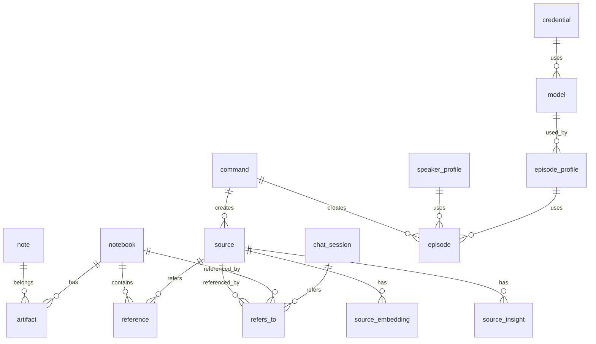

# 数据库表设计文档

本文档描述了 Open Notebook 项目中所有数据库表的设计和结构。

## 表列表

项目共包含 19 张表，按字母顺序排列：

### 1. artifact

**类型**: RELATION 表 (关系表)
**描述**: 连接 note 和 notebook 的关系表

**字段**:

- `in`: record<note> - 指向 note 表的外键
- `out`: record<notebook> - 指向 notebook 表的外键

### 2. chat_session

**类型**: ANY 表
**描述**: 聊天会话表

**字段**:

- `model_override`: option<string> - 可选的模型覆盖设置

### 3. command

**类型**: ANY 表
**描述**: 命令表

**字段**: 无特定字段定义

### 4. credential

**类型**: NORMAL SCHEMAFULL 表
**描述**: 凭证配置表，用于存储各种 API 和服务的认证信息

**字段**:

- `api_key`: option<string> - API 密钥
- `api_version`: option<string> - API 版本
- `base_url`: option<string> - 基础 URL
- `created`: option<datetime> - 创建时间，默认为当前时间
- `credentials_path`: option<string> - 凭证路径
- `endpoint`: option<string> - 端点
- `endpoint_embedding`: option<string> - 嵌入端点
- `endpoint_llm`: option<string> - LLM 端点
- `endpoint_stt`: option<string> - 语音转文本端点
- `endpoint_tts`: option<string> - 文本转语音端点
- `location`: option<string> - 位置信息
- `modalities`: array<string> - 模态列表，默认为空数组
- `name`: string - 凭证名称
- `project`: option<string> - 项目信息
- `provider`: string - 提供商
- `updated`: option<datetime> - 更新时间，默认为当前时间

**索引**:

- `idx_credential_provider`: 基于 provider 字段的索引

### 5. episode

**类型**: NORMAL SCHEMAFULL 表
**描述**: 播客剧集表

**字段**:

- `audio_file`: option<string> - 音频文件路径
- `briefing`: option<string> - 剧集简介
- `command`: option<record<command>> - 关联的命令
- `content`: option<string> - 剧集内容
- `created`: datetime - 创建时间，默认为当前时间
- `episode_profile`: object - 剧集配置，灵活类型
- `name`: string - 剧集名称
- `outline`: option<object> - 剧集大纲，灵活类型
- `speaker_profile`: object - 说话人配置，灵活类型
- `transcript`: option<object> - 转录内容，灵活类型
- `updated`: datetime - 更新时间，默认为当前时间

**索引**:

- `idx_episode_command`: 基于 command 字段的索引
- `idx_episode_profile`: 基于 episode_profile 字段的索引

### 6. episode_profile

**类型**: NORMAL SCHEMAFULL 表
**描述**: 播客剧集配置文件表

**字段**:

- `created`: datetime - 创建时间，默认为当前时间
- `default_briefing`: string - 默认简介
- `description`: option<string> - 描述信息
- `language`: option<string> - 语言设置
- `name`: string - 配置文件名称
- `num_segments`: int - 片段数量，默认为 5
- `outline_llm`: option<record<model>> - 大纲生成模型
- `outline_model`: option<string> - 大纲模型
- `outline_provider`: option<string> - 大纲提供商
- `speaker_config`: string - 说话人配置
- `transcript_llm`: option<record<model>> - 转录生成模型
- `transcript_model`: option<string> - 转录模型
- `transcript_provider`: option<string> - 转录提供商
- `updated`: datetime - 更新时间，默认为当前时间

**索引**:

- `idx_episode_profile_name`: 基于 name 字段的唯一索引

### 7. model

**类型**: ANY 表
**描述**: AI 模型配置表

**字段**:

- `credential`: option<record<credential>> - 关联的凭证

### 8. note

**类型**: NORMAL SCHEMAFULL 表
**描述**: 笔记表

**字段**:

- `content`: option<string> - 笔记内容
- `created`: datetime - 创建时间，默认为当前时间
- `embedding`: option<array<float>> - 嵌入向量
- `note_type`: option<string> - 笔记类型
- `summary`: option<string> - 摘要
- `title`: option<string> - 标题
- `updated`: datetime - 更新时间，默认为当前时间

**索引**:

- `idx_note`: 基于 content 字段的全文搜索索引
- `idx_note_title`: 基于 title 字段的全文搜索索引

### 9. notebook

**类型**: NORMAL SCHEMAFULL 表
**描述**: 笔记本表

**字段**:

- `archived`: option<bool> - 是否归档，默认为 false
- `created`: datetime - 创建时间，默认为当前时间
- `description`: option<string> - 描述信息
- `name`: option<string> - 笔记本名称
- `updated`: datetime - 更新时间，默认为当前时间

### 10. open_notebook

**类型**: ANY 表
**描述**: 开放笔记本表

**字段**: 无特定字段定义

### 11. podcast_config

**类型**: ANY 表
**描述**: 播客配置表

**字段**: 无特定字段定义

### 12. reference

**类型**: RELATION 表 (关系表)
**描述**: 连接 source 和 notebook 的关系表

**字段**:

- `in`: record<source> - 指向 source 表的外键
- `out`: record<notebook> - 指向 notebook 表的外键

### 13. refers_to

**类型**: RELATION 表 (关系表)
**描述**: 连接 chat_session 和 notebook|source 的关系表

**字段**:

- `in`: record<chat_session> - 指向 chat_session 表的外键
- `out`: record<notebook | source> - 指向 notebook 或 source 表的外键

### 14. source

**类型**: NORMAL SCHEMAFULL 表
**描述**: 源内容表，存储文档、文章等内容

**字段**:

- `asset`: option<object> - 资产信息，灵活类型
- `command`: option<record<command>> - 关联的命令
- `created`: datetime - 创建时间，默认为当前时间
- `full_text`: option<string> - 完整文本内容
- `title`: option<string> - 标题
- `topics`: option<array<string>> - 主题标签列表
- `updated`: datetime - 更新时间，默认为当前时间

**事件**:

- `source_delete`: 当 source 记录被删除时，自动删除相关的 source_embedding 和 source_insight 记录

**索引**:

- `idx_source_full_text`: 基于 full_text 字段的全文搜索索引
- `idx_source_title`: 基于 title 字段的全文搜索索引

### 15. source_embedding

**类型**: NORMAL SCHEMAFULL 表
**描述**: 源内容嵌入向量表，存储文本块的嵌入向量

**字段**:

- `content`: string - 文本内容
- `embedding`: array<float> - 嵌入向量
- `order`: int - 顺序号
- `source`: record<source> - 指向 source 表的外键

**索引**:

- `idx_source_embed_chunk`: 基于 content 字段的全文搜索索引
- `idx_source_embedding_source`: 基于 source 字段的索引

### 16. source_insight

**类型**: NORMAL SCHEMAFULL 表
**描述**: 源内容洞察表，存储从源内容中提取的洞察信息

**字段**:

- `content`: string - 洞察内容
- `embedding`: option<array<float>> - 嵌入向量
- `insight_type`: string - 洞察类型
- `source`: record<source> - 指向 source 表的外键

**索引**:

- `idx_source_insight`: 基于 content 字段的全文搜索索引
- `idx_source_insight_source`: 基于 source 字段的索引

### 17. speaker_profile

**类型**: NORMAL SCHEMAFULL 表
**描述**: 说话人配置文件表，用于播客生成

**字段**:

- `created`: datetime - 创建时间，默认为当前时间
- `description`: option<string> - 描述信息
- `name`: string - 配置文件名称
- `speakers`: array<object> - 说话人列表
- `speakers[*].backstory`: option<string> - 说话人背景故事
- `speakers[*].name`: string - 说话人名称
- `speakers[*].personality`: option<string> - 说话人个性
- `speakers[*].voice_id`: option<string> - 语音 ID
- `speakers[*].voice_model`: option<record<model>> - 语音模型
- `tts_model`: option<string> - TTS 模型
- `tts_provider`: option<string> - TTS 提供商
- `updated`: datetime - 更新时间，默认为当前时间
- `voice_model`: option<record<model>> - 语音模型

**索引**:

- `idx_speaker_profile_name`: 基于 name 字段的唯一索引

### 18. test_items

**类型**: ANY 表
**描述**: 测试项目表

**字段**: 无特定字段定义

### 19. transformation

**类型**: NORMAL SCHEMAFULL 表
**描述**: 转换规则表，用于定义内容转换规则

**字段**:

- `apply_default`: bool - 是否默认应用，默认为 false
- `created`: datetime - 创建时间，默认为当前时间
- `description`: string - 描述信息
- `name`: string - 转换规则名称
- `prompt`: string - 转换提示
- `title`: string - 标题
- `updated`: datetime - 更新时间，默认为当前时间

## 表关系图

## 总结

Open Notebook 的数据库设计采用了 SurrealDB 的灵活模式，包含了以下几个主要模块：

1. **内容管理模块**: source, source_embedding, source_insight
2. **笔记管理模块**: notebook, note
3. **播客生成模块**: episode, episode_profile, speaker_profile
4. **AI 模型管理模块**: model, credential
5. **关系管理模块**: reference, artifact, refers_to
6. **系统管理模块**: command, chat_session, transformation

这种设计支持复杂的内容管理、AI 驱动的内容分析和播客生成功能。
